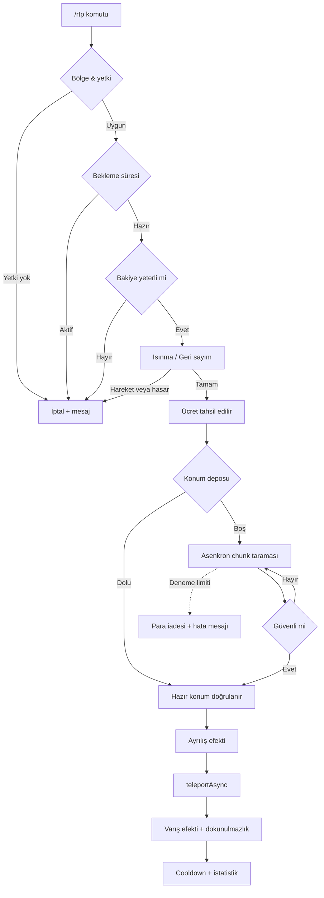

<div align="center">


<br/>

<p>
  
  
  
  
  
</p>

<p>
  <a href="#-kurulum"></a>
  <a href="#-özellikler"></a>
  <a href="#-yapılandırma"></a>
  <a href="#-geliştirici-apisi"></a>
</p>

<p>
  <sub>Türkçe & İngilizce dil desteği • Tam UTF-8 • Asenkron chunk üretimi • Sıfır bağımlılık zorunluluğu</sub>
</p>

</div>

---

<div align="center">

### 💫 Nedir bu?

<table>
<tr><td align="center" width="800">

**UltraRTP**, oyuncuları haritanın rastgele ama **gerçekten güvenli** bir noktasına ışınlayan,<br/>
efektleri, menüleri ve oyun içi yönetim paneliyle eksiksiz bir rastgele ışınlanma sistemidir.<br/><br/>
Lavın ortasına, okyanusun dibine ya da mağaranın içine düşmek yok.<br/>
Chunk üretimi arka planda yapılır, sunucu **donmaz**.

</td></tr>
</table>

</div>

---

## ✦ Özellikler

<table>
<tr>
<td width="50%" valign="top">

### 🛡️ Güvenli Konum Motoru
- Lav, ateş, kaktüs, örümcek ağı, dikit kontrolü
- Okyanus / nehir / sahil biyom kara listesi
- Mağara & yer altı ("tavan altı") reddi
- Çevre lav taraması (yarıçaplı)
- Nether için özel tavan-altı tarama algoritması
- Y ekseni sınırları (bölge bazlı ezilebilir)
- WorldBorder'a tam uyum

</td>
<td width="50%" valign="top">

### ⚡ Performans
- `getChunkAtAsync` ile **asenkron** chunk üretimi
- Bölge başına **hazır konum deposu** (anlık ışınlanma)
- Eşzamanlı arama limiti (TPS koruması)
- Deneme başına ayarlanabilir tick gecikmesi
- Sunucu boşken depo üretimini durdurma
- Ana thread hiçbir zaman bloklanmaz

</td>
</tr>
<tr>
<td width="50%" valign="top">

### 🎆 Işınlanma Efektleri
- Isınma sırasında **sarmal parçacık** animasyonu
- Ayrılış / varış **halka patlaması**
- Her aşama için ayrı parçacık + ses tanımı
- `TITLE` · `ACTIONBAR` · `BOSSBAR` geri sayım
- İlerleme çubuklu action bar
- Panel üzerinden canlı efekt önizleme

</td>
<td width="50%" valign="top">

### 🎛️ Menüler & Panel
- Tıkla-ışınlan **oyuncu GUI**'si (bölge seçimi)
- Bakiye, istatistik ve bekleme süresi kartı
- Rastgele bölge & önceki konuma dönüş butonu
- **Admin kontrol paneli** — her ayar oyun içinden
- Sohbetten elle değer girme (orta tık)
- Bölge yöneticisi: yarıçap, ücret, ikon, dünya

</td>
</tr>
<tr>
<td width="50%" valign="top">

### 💰 Ekonomi & Limitler
- Vault ile **ücretli ışınlanma**
- Başarısızlıkta otomatik para iadesi
- Bölge bazlı ücret ve bekleme süresi
- Yetki bazlı indirimli bekleme (`vip`, `mvp`, ...)
- Ortak veya bölge bazlı cooldown modu
- Yeniden başlatmaya dayanıklı cooldown kaydı

</td>
<td width="50%" valign="top">

### 🔌 Entegrasyonlar
- **Vault** — ekonomi
- **PlaceholderAPI** — 20+ placeholder + mesajlarda `%papi%`
- **ItemsAdder** — menülerde özel eşya ikonları
- Hepsi `config.yml`'den tek satırla açılıp kapanır
- Eklenti yoksa otomatik devre dışı, hata yok

</td>
</tr>
</table>

<div align="center">

### 🧩 Ekstralar

`/rtp back` geri dönüş · ışınlanma sonrası dokunulmazlık · düşme hasarı sıfırlama · hareket/hasar ile iptal
<br/>
oyuncu istatistikleri · geliştirici event API'si · TR & EN dil dosyaları · tam UTF-8 Türkçe karakter desteği

</div>

---

## 📦 Kurulum

<div align="center">

| Adım | İşlem |
|:---:|:---|
| **1** | `UltraRTP-1.0.0.jar` dosyasını sunucunun `plugins/` klasörüne at |
| **2** | Sunucuyu yeniden başlat |
| **3** | `plugins/UltraRTP/config.yml` dosyasını düzenle |
| **4** | `/rtpadmin reload` ya da `/rtpadmin` panelinden ayarla |

</div>

### 🔨 Kaynaktan derleme

```bash
git clone https://github.com/yefeblgn/UltraRTP.git
cd UltraRTP
mvn clean package
```

> Maven kurulu değilse depodaki `build.ps1` betiğini çalıştırman yeterli — Maven'ı kendi indirir.

```powershell
powershell -ExecutionPolicy Bypass -File build.ps1
```

Çıktı: `target/UltraRTP-1.0.0.jar`

<div align="center">

**Gereksinimler** —     

</div>

---

## 🕹️ Komutlar

<div align="center">

| Komut | Açıklama | Yetki |
|:---|:---|:---|
| `/rtp` | Menüyü açar (ya da doğrudan ışınlar) | `ultrartp.use` |
| `/rtp <bölge>` | Belirli bir bölgeye ışınlanır | `ultrartp.use` |
| `/rtp menu` | Işınlanma menüsünü açar | `ultrartp.menu` |
| `/rtp back` | Önceki konumuna döner | `ultrartp.back` |
| `/rtp iptal` | Devam eden ışınlanmayı iptal eder | `ultrartp.use` |
| `/rtp list` | Erişebildiğin bölgeleri listeler | `ultrartp.use` |
| `/rtpadmin` | Yönetim panelini açar | `ultrartp.admin` |
| `/rtpadmin reload` | Config + dil dosyalarını yeniler | `ultrartp.admin` |
| `/rtpadmin cache <info\|clear\|refill>` | Konum deposunu yönetir | `ultrartp.admin` |
| `/rtpadmin cooldown reset <oyuncu\|*>` | Bekleme sürelerini sıfırlar | `ultrartp.admin` |
| `/rtpadmin tp <oyuncu> [bölge]` | Oyuncuyu zorla ışınlar | `ultrartp.admin` |
| `/rtpzone çubuk` | Bölge seçim çubuğunu verir | `ultrartp.zone` |
| `/rtpzone oluştur <isim> <dünya> <cooldown>` | Seçili alandan bölge oluşturur | `ultrartp.zone` |
| `/rtpzone liste` | RTP bölgelerini listeler | `ultrartp.zone` |
| `/rtpzone bilgi <isim>` | Bölge detaylarını gösterir | `ultrartp.zone` |
| `/rtpzone düzenle <isim> <ayar> <değer>` | Bölge ayarını değiştirir | `ultrartp.zone` |
| `/rtpzone kaldır <isim>` | Bölgeyi siler | `ultrartp.zone` |
| `/rtpzone ışınla <isim>` | Bölgeyi hemen tetikler | `ultrartp.zone` |

<sub>Takma adlar: `/randomtp` · `/wild` · `/rastgele` · `/vahsi` · `/rtpa` · `/rtpbolge` · `/rtpz`</sub>

</div>

### 🔑 Yetkiler

<div align="center">

| Yetki | Varsayılan | Açıklama |
|:---|:---:|:---|
| `ultrartp.use` | ✅ herkes | Temel `/rtp` kullanımı |
| `ultrartp.menu` | ✅ herkes | GUI menüsünü açabilir |
| `ultrartp.back` | ✅ herkes | `/rtp back` kullanabilir |
| `ultrartp.admin` | 🛡️ op | Panel ve tüm yönetim komutları |
| `ultrartp.zone` | 🛡️ op | `/rtpzone` ile bölge yönetimi |
| `ultrartp.zone.bypass` | ❌ | RTP bölgelerinden etkilenmez |
| `ultrartp.other` | 🛡️ op | Başka oyuncuyu ışınlayabilir |
| `ultrartp.region.<id>` | 🛡️ op | Belirli bir bölgeye erişim |
| `ultrartp.region.*` | 🛡️ op | Tüm bölgelere erişim |
| `ultrartp.bypass.cooldown` | ❌ | Bekleme süresinden muaf |
| `ultrartp.bypass.cost` | ❌ | Ücretten muaf |
| `ultrartp.bypass.warmup` | ❌ | Işınlanma gecikmesinden muaf |
| `ultrartp.cooldown.<grup>` | ❌ | Gruba özel kısa bekleme (`vip`, `mvp`) |

</div>

---

## ⚙️ Yapılandırma

<details>
<summary><b>🌍 Bölge tanımlama</b> — kare/daire, sabit/spawn/oyuncu merkezli</summary>

```yaml
regions:
  overworld:
    enabled: true
    display-name: "<gradient:#7CFC8F:#2ECC71><bold>Vahşi Doğa</bold></gradient>"
    icon: GRASS_BLOCK          # Material ya da "ia:namespace:id"
    slot: 20                   # menüdeki yeri
    world: world
    shape: SQUARE              # SQUARE | CIRCLE
    center: WORLD_SPAWN        # WORLD_SPAWN | FIXED | PLAYER
    center-x: 0
    center-z: 0
    min-radius: 750
    max-radius: 7500
    permission: ""             # boş = herkes
    cost: -1                   # -1 = genel ayarı kullan
    cooldown: -1
    lore:
      - "<gray>Yüzey dünyasında rastgele"
      - "<gray>bir noktaya ışınlanırsın."
```

</details>

<details>
<summary><b>🛡️ Güvenlik ayarları</b> — nereye ışınlanmasın?</summary>

```yaml
safety:
  allow-water: false           # suya ışınlanma
  avoid-under-roof: true       # mağara/yer altı reddi
  roof-scan-limit: 45
  required-air-above: 2
  min-y: -48
  max-y: 250
  danger-scan-radius: 2        # çevrede lav taraması
  respect-world-border: true
  blocked-biomes:
    - minecraft:ocean
    - minecraft:river
    - minecraft:beach
```

</details>

<details>
<summary><b>🎆 Efekt ayarları</b> — parçacık, ses, geri sayım</summary>

```yaml
effects:
  warmup:
    particle:
      enabled: true
      type: PORTAL
      count: 6
      spiral: true             # oyuncunun çevresinde döner
      radius: 1.1
      color: "#8A2BE2"
    sound:
      enabled: true
      type: block.note_block.hat
      volume: 0.7
      pitch: 1.4

  countdown:
    mode: ALL                  # NONE | TITLE | ACTIONBAR | BOSSBAR | BOTH | ALL
    bossbar-color: PURPLE
    bossbar-overlay: NOTCHED_10
```

</details>

<details>
<summary><b>⚡ Performans & konum deposu</b></summary>

```yaml
general:
  max-attempts: 45             # bir konum için maks. deneme
  attempt-delay-ticks: 1       # denemeler arası bekleme
  max-concurrent-searches: 4   # aynı anda arama yapan oyuncu

cache:
  enabled: true
  size-per-region: 8           # bölge başına hazır konum
  refill-interval-seconds: 30
  max-generate-per-cycle: 2
  pause-when-empty: true       # sunucu boşken üretme
```

> 💡 **İpucu:** Depo açıkken oyuncular chunk üretimini hiç beklemez, ışınlanma **anlık** olur.

</details>

<details>
<summary><b>🌐 Dil değiştirme</b> — tr / en / kendi dilin</summary>

```yaml
general:
  language: tr     # plugins/UltraRTP/lang/tr.yml
```

Kendi dilini eklemek için `lang/` klasörüne `xx.yml` koy ve `language: xx` yaz.
Eksik satırlar otomatik olarak varsayılandan tamamlanır — güncellemelerde dosyan bozulmaz.

Tüm metinler [MiniMessage](https://docs.advntr.dev/minimessage/format.html) formatındadır:

```yaml
prefix: "<gradient:#00D4FF:#7B2FF7><bold>RTP</bold></gradient> <dark_gray>»</dark_gray> "
teleport:
  success: "<prefix><green><region> <gray>bölgesine ışınlandın."
```

</details>

---

## 🔗 Entegrasyonlar

```yaml
hooks:
  vault:
    enabled: true
  placeholderapi:
    enabled: true
    parse-in-messages: true    # lang dosyalarında %papi% kullanabilirsin
  itemsadder:
    enabled: true
    fallback-material: ENDER_PEARL
```

### 📊 PlaceholderAPI

<div align="center">

| Placeholder | Çıktı |
|:---|:---|
| `%ultrartp_cooldown%` | Kalan bekleme (saniye) |
| `%ultrartp_cooldown_formatted%` | `1dk 20sn` |
| `%ultrartp_cooldown_<bölge>%` | Bölgeye özel bekleme |
| `%ultrartp_can_teleport%` | `true` / `false` |
| `%ultrartp_teleports%` | Toplam ışınlanma sayısı |
| `%ultrartp_cost%` | Varsayılan ücret |
| `%ultrartp_cost_<bölge>%` | Bölge ücreti |
| `%ultrartp_regions%` | Erişebildiğin bölge sayısı |
| `%ultrartp_regions_total%` | Toplam açık bölge |
| `%ultrartp_region_name_<bölge>%` | Bölgenin görünen adı |
| `%ultrartp_warmup%` | Ayarlı gecikme süresi |
| `%ultrartp_warmup_remaining%` | Devam eden ışınlanmanın kalanı |
| `%ultrartp_in_warmup%` | `true` / `false` |
| `%ultrartp_back_available%` | Geri dönülebilir mi |
| `%ultrartp_cache_total%` | Depodaki hazır konum |
| `%ultrartp_cache_<bölge>%` | Bölge deposu |
| `%ultrartp_language%` | Aktif dil |
| `%ultrartp_version%` | Eklenti sürümü |

</div>

### 🧱 ItemsAdder

Menü ikonlarında özel eşya kullanmak için üç yazım da geçerlidir:

```yaml
icon: "ia:mypack:portal_orb"
icon: "itemsadder:mypack:portal_orb"
icon: "mypack:portal_orb"
```

> ItemsAdder kurulu değilse ya da eşya bulunamazsa `fallback-material` devreye girer — hata oluşmaz.

---

## 🔄 Işınlanma akışı



---

## 🧑‍💻 Geliştirici APIsi

İki adet Bukkit event'i yayınlanır:

```java
@EventHandler
public void onPreTeleport(RTPPreTeleportEvent event) {
    Player player = event.getPlayer();
    Region region = event.getRegion();

    if (player.getWorld().getName().equals("arena")) {
        event.setCancelled(true); // ışınlanma başlamaz, para çekilmez
    }
}

@EventHandler
public void onTeleport(RTPTeleportEvent event) {
    Location from = event.getFrom();
    Location to = event.getTo();
    getLogger().info(event.getPlayer().getName() + " -> " + to.getBlockX() + "/" + to.getBlockZ());
}
```

Eklenti örneğine erişim:

```java
UltraRTP rtp = UltraRTP.instance();

rtp.teleports().request(player, rtp.config().region("nether"));
rtp.teleports().forceTeleport(player, region);   // kontrolleri atlar
long left = rtp.teleports().remainingCooldown(player, region);
int cached = rtp.cache().size("overworld");
```

<details>
<summary><b>📁 Proje yapısı</b></summary>

```
src/main/java/com/yefeblgn/ultrartp/
├── UltraRTP.java              # ana sınıf
├── api/                       # RTPPreTeleportEvent, RTPTeleportEvent
├── command/                   # /rtp, /rtpadmin
├── config/                    # ConfigManager, Messages (lang)
├── data/                      # DataStore (cooldown, istatistik, back)
├── gui/                       # Menu, MainMenu, ChatInputManager
│   └── admin/                 # yönetim paneli menüleri
├── hook/                      # Vault, PlaceholderAPI, ItemsAdder
├── listener/                  # GUI ve oyuncu olayları
├── model/                     # Region, EffectSet
├── teleport/                  # SafetyChecker, LocationFinder, Cache, Manager
└── util/                      # Text, ItemBuilder, Formatter, Registries
```

</details>

---

## ❓ SSS

<details>
<summary><b>Işınlanma çok yavaş, ne yapmalıyım?</b></summary>

`cache.enabled: true` yapıp `size-per-region` değerini artır. Depo doluyken ışınlanma anlık olur.
Ayrıca `max-attempts` değerini düşürüp `blocked-biomes` listesini kısaltmak da hızlandırır.

</details>

<details>
<summary><b>Sunucu ışınlanma sırasında donuyor</b></summary>

`attempt-delay-ticks` değerini `2`–`3` yap ve `max-concurrent-searches` değerini düşür.
Chunk üretimi doğası gereği ağırdır; depo sistemi bunu arka plana taşır.

</details>

<details>
<summary><b>Oyuncular okyanusa/mağaraya düşüyor</b></summary>

`safety.allow-water: false`, `safety.avoid-under-roof: true` olduğundan ve
okyanus biyomlarının `blocked-biomes` listesinde bulunduğundan emin ol.

</details>

<details>
<summary><b>Türkçe karakterler bozuk görünüyor</b></summary>

`config.yml` ve `lang/tr.yml` dosyalarını **UTF-8** olarak kaydet.
Windows Not Defteri yerine VS Code ya da Notepad++ kullan.

</details>

<details>
<summary><b>Ücret alınmıyor</b></summary>

Vault ve bir ekonomi eklentisi (EssentialsX, CMI, ...) kurulu olmalı.
`/rtpadmin` panelindeki istatistik kartından Vault durumunu kontrol edebilirsin.

</details>

---

<details>
<summary><h3>🇬🇧 English summary</h3></summary>

**UltraRTP** is a full-featured random teleport plugin for **PaperMC 1.21.8**.

- Genuinely safe location engine (lava, water, void, caves, biome blacklist, world border)
- Fully asynchronous chunk generation + pre-generated location cache
- Warmup with move/damage cancel, title · actionbar · bossbar countdown
- Particle & sound effects for every stage (spiral warmup, departure/arrival rings)
- Player GUI menu and a complete in-game **admin control panel**
- Vault economy, PlaceholderAPI (20+ placeholders), ItemsAdder custom icons
- Per-region cost, cooldown, radius, world, shape and permission
- `/rtp back`, post-teleport invulnerability, player statistics
- TR / EN language files, add your own under `lang/`

Set `general.language: en` in `config.yml` to switch the plugin to English.

</details>

---

<div align="center">

### 🤝 Katkı

Pull request'ler ve issue'lar açıktır. Büyük değişikliklerden önce bir issue açman yeterli.

<br/>

<a href="https://github.com/yefeblgn">
  
</a>
<a href="https://github.com/yefeblgn/UltraRTP/issues">
  
</a>
<a href="https://github.com/yefeblgn/UltraRTP/stargazers">
  
</a>

<br/><br/>

**MIT Lisansı** ile dağıtılmaktadır.


<sub>UltraRTP • yefeblgn tarafından ❤️ ile geliştirildi</sub>

</div>
